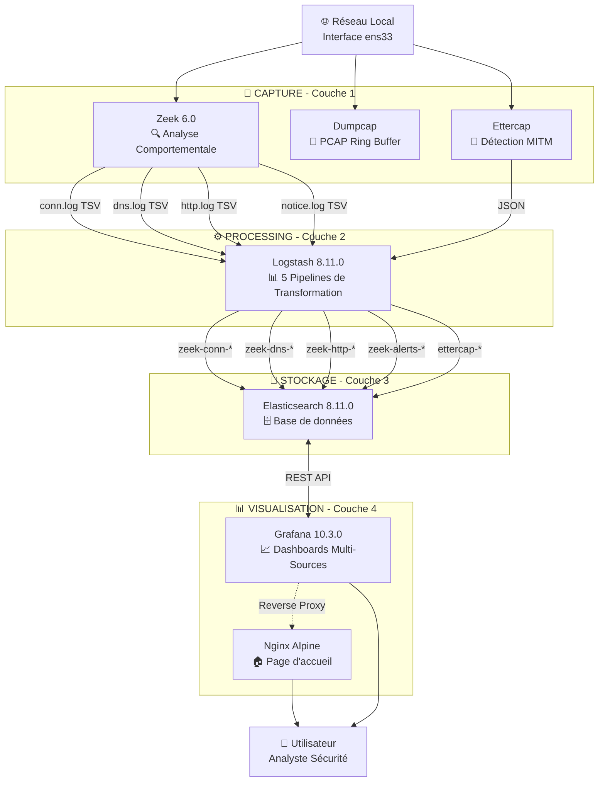

# Architecture GLENZ Stack - Plateforme de Surveillance Réseau

**Projet GLENZ - Grafana-Logstash-Elasticsearch-Nginx-Zeek**
École Supérieure Polytechnique - UCAD
Département Génie Informatique - DIC-2-SSI

---

## 📋 Table des Matières

1. [Vue d'Ensemble](#vue-densemble)
2. [Stack Technologique](#stack-technologique)
3. [Architecture](#architecture)
4. [Flux de Données](#flux-de-données)
5. [Composants](#composants)
6. [Stockage](#stockage)
7. [Utilisation](#utilisation)

---

## Vue d'Ensemble

Système de surveillance réseau basé sur une approche comportementale avec Zeek, transformation de données via Logstash, et visualisation avancée via Grafana.

### Objectifs

- ✅ Capture complète du trafic réseau (PCAP avec ring buffer)
- ✅ Analyse comportementale du réseau (Zeek)
- ✅ Détection d'anomalies et MITM (Ettercap)
- ✅ Transformation et enrichissement des logs (Logstash)
- ✅ Visualisation multi-datasources (Grafana)
- ✅ Architecture modulaire et extensible

---

## Stack Technologique

| Composant | Version | Rôle |
|-----------|---------|------|
| **Zeek** | 6.0 | IDS behavioral - Analyse protocolaire |
| **Dumpcap** | Latest | Capture PCAP avec ring buffer automatique |
| **Ettercap** | Latest | Détection ARP/DNS/MITM |
| **Logstash** | 8.11.0 | Transformation et enrichissement des logs |
| **Elasticsearch** | 8.11.0 | Stockage et indexation |
| **Grafana** | 10.3.0 | Visualisation et dashboards |
| **Nginx** | Alpine | Page d'accueil et proxy |

### Philosophie de la Stack GLENZ

**Approche Behavioral vs Signature:**
- ✅ Zeek analyse le comportement du réseau (pas de signatures)
- ✅ Génère 20+ types de logs (conn, dns, http, ssl, ssh, etc.)
- ✅ Détection d'anomalies basée sur le contexte

**Transformation vs Simple Forwarding:**
- ✅ Logstash parse et transforme les logs Zeek (TSV → JSON)
- ✅ 5 pipelines dédiés (conn, dns, http, notice, ettercap)
- ✅ Enrichissement avec GeoIP et filtres

**Multi-Source Visualization:**
- ✅ Grafana supporte plusieurs datasources
- ✅ Variables dynamiques et filtres avancés
- ✅ Unified Alerting pour centraliser les alertes

---

## Architecture

### Schéma Simplifié



---

## Flux de Données

### 1. Capture Réseau

**Zeek (Behavioral IDS):**
```
Interface ens33 → Zeek Engine
    ↓
Génération de logs TSV:
  - conn.log (connexions: src_ip, dst_ip, proto, bytes, duration)
  - dns.log (requêtes DNS: query, answer, rcode)
  - http.log (trafic HTTP: method, uri, user_agent, status)
  - ssl.log (certificats SSL/TLS)
  - notice.log (alertes comportementales)
```

**Dumpcap (PCAP Capture):**
```
Interface ens33 → Dumpcap
    ↓
Ring Buffer:
  - Fichiers: 10 × 1GB
  - Rotation automatique
  - Rétention: 7 jours
    ↓
/data/pcap/YYYY-MM-DD/capture_*.pcap
```

**Ettercap (MITM Detection):**
```
Interface ens33 → Ettercap (mode passif)
    ↓
Détection:
  - ARP spoofing
  - DNS poisoning
  - MAC address conflicts
    ↓
/data/logs/ettercap/ettercap.log (JSON)
```

### 2. Transformation (Logstash)

**Pipeline 1: Zeek Connections**
```
Input: /data/logs/zeek/current/conn.log (TSV)
    ↓
Filter:
  - Dissect TSV → JSON
  - Convert types (int, float)
  - Rename fields (id.orig_h → src_ip)
  - Add fields (log_type, event_type)
    ↓
Output: zeek-conn-YYYY.MM.dd
```

**Pipeline 2: Zeek DNS**
```
Input: /data/logs/zeek/current/dns.log (TSV)
    ↓
Filter:
  - Parse DNS queries/answers
  - Extract DNS server, query, rcode
    ↓
Output: zeek-dns-YYYY.MM.dd
```

**Pipeline 3: Zeek HTTP**
```
Input: /data/logs/zeek/current/http.log (TSV)
    ↓
Filter:
  - Parse HTTP method, URI, user_agent
  - Convert status_code to integer
    ↓
Output: zeek-http-YYYY.MM.dd
```

**Pipeline 4: Zeek Alerts**
```
Input: /data/logs/zeek/current/notice.log (TSV)
    ↓
Filter:
  - Parse notice type, message
  - Extract geolocation data
    ↓
Output: zeek-alerts-YYYY.MM.dd
```

**Pipeline 5: Ettercap**
```
Input: /data/logs/ettercap/ettercap.log (JSON)
    ↓
Filter:
  - Add event_type: mitm_detection
    ↓
Output: ettercap-YYYY.MM.dd
```

### 3. Stockage (Elasticsearch)

**Indices créés:**
```
zeek-conn-*      → Connexions réseau
zeek-dns-*       → Requêtes DNS
zeek-http-*      → Trafic HTTP
zeek-alerts-*    → Alertes Zeek
ettercap-*       → Détections MITM
```

**Schéma de données:**
```json
{
  "@timestamp": "2024-02-15T10:30:00.000Z",
  "src_ip": "192.168.1.100",
  "dst_ip": "8.8.8.8",
  "src_port": 54321,
  "dst_port": 53,
  "proto": "udp",
  "service": "dns",
  "duration": 0.05,
  "orig_bytes": 45,
  "resp_bytes": 120,
  "log_type": "zeek",
  "event_type": "dns"
}
```

### 4. Visualisation (Grafana)

**Datasource Elasticsearch:**
```
Name: Elasticsearch-Zeek
URL: http://elasticsearch:9200
Database: zeek-*
Time Field: @timestamp
```

**Dashboards:**
1. **Zeek Network Overview** - Vue d'ensemble du trafic
2. **DNS Analysis** - Analyse des requêtes DNS
3. **HTTP Traffic** - Analyse du trafic HTTP
4. **Security Alerts** - Alertes comportementales
5. **MITM Detection** - Détections Ettercap

---

## Composants

### 1. Zeek (IDS Behavioral)

**Rôle:** Analyse comportementale du trafic réseau

**Configuration:**
```zeek
# /configs/zeek/local.zeek
@load base/protocols/conn
@load base/protocols/dns
@load base/protocols/http
@load policy/protocols/http/detect-sqli
@load policy/protocols/http/detect-webapps

redef Site::local_nets = {
    192.168.0.0/16,
    10.0.0.0/8,
    172.16.0.0/12
};
```

**Logs générés:**
- conn.log - Toutes les connexions réseau
- dns.log - Requêtes et réponses DNS
- http.log - Trafic HTTP (méthodes, URIs, user-agents)
- ssl.log - Certificats SSL/TLS
- notice.log - Alertes comportementales

### 2. Logstash (Data Processing)

**Rôle:** Transformation TSV → JSON et enrichissement

**Configuration:**
```yaml
# /configs/logstash/logstash.yml
pipeline.workers: 2
pipeline.batch.size: 125
queue.type: memory
```

**Pipelines:**
- 01-zeek-conn.conf - Parse connexions
- 02-zeek-dns.conf - Parse DNS
- 03-zeek-http.conf - Parse HTTP
- 04-zeek-notice.conf - Parse alertes
- 05-ettercap.conf - Parse Ettercap

### 3. Elasticsearch (Storage)

**Rôle:** Stockage et indexation des événements

**Configuration:**
```yaml
discovery.type: single-node
ES_JAVA_OPTS: -Xms2g -Xmx2g
xpack.security.enabled: false
```

**Indices:**
```
zeek-conn-2024.02.15    (5000 docs, 2MB)
zeek-dns-2024.02.15     (3000 docs, 1MB)
zeek-http-2024.02.15    (1500 docs, 800KB)
zeek-alerts-2024.02.15  (50 docs, 50KB)
ettercap-2024.02.15     (10 docs, 10KB)
```

### 4. Grafana (Visualization)

**Rôle:** Dashboards et visualisation multi-sources

**Configuration:**
```yaml
# Datasource provisionning
apiVersion: 1
datasources:
  - name: Elasticsearch-Zeek
    type: elasticsearch
    url: http://elasticsearch:9200
    database: "zeek-*"
```

**Dashboards:**
- Variables dynamiques ($interface, $timerange)
- Requêtes Lucene sur Elasticsearch
- Unified Alerting pour notifications

### 5. Dumpcap (PCAP Capture)

**Rôle:** Capture PCAP avec ring buffer

**Configuration:**
```bash
dumpcap \
    -i ens33 \
    -b filesize:1000 \  # 1GB par fichier
    -b files:10 \       # 10 fichiers max
    -w /data/pcap/capture.pcap
```

### 6. Ettercap (MITM Detection)

**Rôle:** Détection ARP/DNS spoofing

**Mode:** Passif (pas d'injection)

**Logs:** JSON format pour Logstash

### 7. Nginx (Reverse Proxy)

**Rôle:** Page d'accueil et proxy

**Endpoints:**
- `/` → Page d'accueil GLENZ
- `http://grafana.localhost` → Grafana

---

## Stockage

### Structure des Données

```
data/
├── elasticsearch/           # Index Elasticsearch
│   └── nodes/
├── grafana/                # Dashboards et configuration
│   └── grafana.db
├── logs/
│   ├── zeek/               # Logs Zeek
│   │   └── current/
│   │       ├── conn.log    (TSV, rotated hourly)
│   │       ├── dns.log
│   │       ├── http.log
│   │       └── notice.log
│   └── ettercap/           # Logs Ettercap
│       └── ettercap.log    (JSON)
└── pcap/                   # PCAP ring buffer
    └── 2024-02-15/
        ├── capture_00001.pcap
        ├── capture_00002.pcap
        └── ... (10 files max)
```

### Taille Estimée

| Composant | Taille/jour | Rétention | Total |
|-----------|-------------|-----------|-------|
| Zeek logs | 500MB | 30 jours | 15GB |
| Elasticsearch | 1GB | 30 jours | 30GB |
| PCAP | 10GB | 7 jours | 70GB |
| Grafana | 10MB | Permanent | 10MB |
| **Total** | | | **~115GB** |

---

## Utilisation

### Accès aux Interfaces

**Grafana (Dashboards):**
```
URL: http://localhost:3000
User: admin
Pass: admin
```

**Elasticsearch (API):**
```bash
# Santé du cluster
curl http://localhost:9200/_cluster/health?pretty

# Lister les index
curl http://localhost:9200/_cat/indices/zeek-*

# Compter les documents
curl http://localhost:9200/zeek-conn-*/_count

# Recherche simple
curl -X GET "http://localhost:9200/zeek-dns-*/_search?pretty" \
  -H 'Content-Type: application/json' \
  -d '{"query": {"match": {"dns_query": "google.com"}}}'
```

**Nginx (Page d'accueil):**
```
URL: http://localhost
```

### Exemples de Requêtes Grafana

**Top 10 IPs par volume:**
```
Index: zeek-conn-*
Query: *
Metric: sum(orig_bytes)
Group by: src_ip.keyword
```

**Requêtes DNS suspectes:**
```
Index: zeek-dns-*
Query: dns_query:*.exe OR dns_query:*.dll
```

**Alertes Zeek:**
```
Index: zeek-alerts-*
Query: event_type:alert
```

### Analyse PCAP

**Avec Wireshark:**
```bash
# Lister les PCAP
ls -lh data/pcap/2024-02-15/

# Ouvrir avec Wireshark
wireshark data/pcap/2024-02-15/capture_00001.pcap
```

**Avec tshark:**
```bash
# Statistiques
tshark -r capture.pcap -q -z io,stat,60

# Filtrer HTTP
tshark -r capture.pcap -Y "http" -T fields -e ip.src -e http.host
```

---

## Différences avec Stack Précédente

| Aspect | Stack v2.0 (Suricata) | Stack v3.0 (GLENZ) |
|--------|----------------------|-------------------|
| **IDS** | Suricata (signatures) | Zeek (behavioral) |
| **Processing** | Filebeat (forward) | Logstash (transform) |
| **Visualization** | Kibana (KQL) | Grafana (Lucene + variables) |
| **PCAP** | Tcpdump (manual) | Dumpcap (ring buffer) |
| **ARP** | ARPWatch (logging) | Ettercap (MITM detection) |
| **Data Format** | EVE JSON (unified) | TSV → JSON (multi-pipeline) |
| **Complexity** | 7 services | 8 services |
| **RAM** | ~3.2GB | ~3.5GB |

---

## Conclusion

La stack GLENZ offre une approche alternative axée sur:
- **Analyse comportementale** (Zeek vs Suricata)
- **Transformation de données** (Logstash vs Filebeat)
- **Visualisation avancée** (Grafana vs Kibana)
- **Détection MITM** (Ettercap vs ARPWatch)

Cette architecture est particulièrement adaptée pour:
- Analyse forensique réseau
- Détection d'anomalies comportementales
- Recherche de patterns complexes
- Visualisation multi-datasources

---

**Auteur:** Département Génie Informatique - UCAD ESP
**Version:** 3.0 - GLENZ Stack
**Date:** Février 2024
